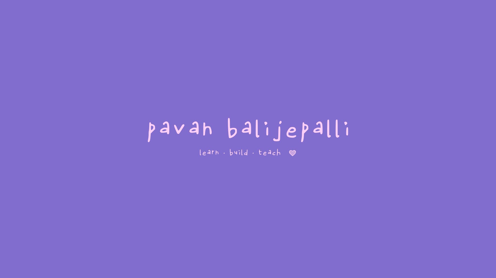

  

<h1 align="center">Pavan Kumar Balijepalli</h1>

  <b>AI Engineer • 6+ Years in Data Science</b> 
  Building practical AI systems that solve real-world business problems.

  
  

---

## 👋 About Me
I am an **AI Engineer** with **6 years of experience in Data Science**, focused on designing and shipping AI-first solutions.

My work centers around:
- 🤖 Applied AI and machine learning systems
- 📊 Data science workflows from exploration to deployment
- 🧠 Building intelligent products with measurable impact

---

## 🧰 AI Portfolio Focus

<table>
  <tr>
    <td><b>Machine Learning & AI</b></td>
    <td>Model development, experimentation, and evaluation for real use cases.</td>
  </tr>
  <tr>
    <td><b>Data Science Practice</b></td>
    <td>Data preparation, feature engineering, insight generation, and predictive analytics.</td>
  </tr>
  <tr>
    <td><b>Production-minded AI</b></td>
    <td>Projects built with a strong focus on practical outcomes and usability.</td>
  </tr>
</table>

---

## 🌟 Featured Repository
### [kundelu_ai](https://github.com/pavankumarbalijepalli/kundelu_ai)
AI-focused project work that reflects my approach to building applied intelligent solutions.

---

## 📈 GitHub AI Snapshot

  
  &nbsp;
  

  

---

## 📬 Reach Me
- LinkedIn: [@pavan-kumar-balijepalli](https://www.linkedin.com/in/pavan-kumar-balijepalli/)
- For quick questions, open an issue on any repository.

  

  

